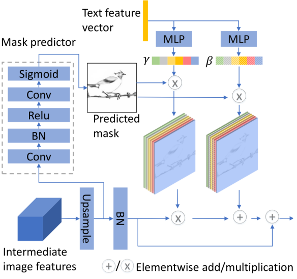

# text2image

哈工大2022春深度学习实验六-自选项目  
文字生成图片  
本仓库复现了论文[Text to Image Generation with Semantic-Spatial Aware GAN]，
代码修改自仓库[https://github.com/wtliao/text2image]

## 网络结构

the spatial-semantic aware (SSA) block 结构 

## 仓库结构 
    
    DAMSM.py    深层注意多模态相似模型(deep attentional multimodal similarity model)的实现
    datasets.py 用户读取数据
    GUI   用于演示的demo
    IS.py   计算IS指标
    miscc   损失函数以及配置
    saved_model 用于保存官方的预习训练模型
    cfg  配置文件
        bird.yml    本仓库使用它
        coco.yml    coco数据集，太大了，本实验中未使用，如需使用请前往[https://github.com/wtliao/text2image]仓库下载
    data    数据存放路径
        birds
    main_finetune.py    finetune的main函数
    model.py    SSA-GAN模型的实现
    sync_batchnorm  sync_batchnorm的实现
    DAMSMencoders   用于保存预训练的text_encoder和image_encoder
    main.py
    
        

## 依赖库

1.运行 `pip install -r requirements.txt` ，注意，tensorflow1.x版本才能进行IS指标的评测（本仓库使用tf1.5）

## 运行前的准备  

1. 下载数据  
    1. 下载[birds_caption_data]，并且将其解压后放在 `data/` 目录下
    2. 下载[birds_data]，并且将其解压后放在 `data/birds/` 目录下

2. 下载预训练 DAMSM 模型
    1. 下载[birds_pre_trained_DAMSM]并且将其解压后放在 `DAMSMencoders/` 目录下
    

## 运行程序
1. 训练
    1. 如果需要的话，可以下载原论文作者提供的预训练模型[onedrive repo] 
    2. 调整[bird.yml]中的设置
    3. `python main.py` （自己从头开始训练） 或  `python main_finetune.py` （使用预训练模型）

2. 评估
    1. 设置[bird.yml]中的 `B_VALIDATION=True` ，运行`python main.py` （自己从头开始训练） 或  `python main_finetune.py` （使用预训练模型）
    
## 评估指标
1. IS
    1. 配置tf1.x环境
    2. 修改[IS.py]中的设置
    2. `python IS.py` 
 
2. FID
    1. 请前往[https://github.com/bioinf-jku/TTUR]
    2. 或者使用我的适配适配后的仓库[https://github.com/1190202328/TTUR]

## 官方的性能

我实际跑出来达不到这个指标，在CUB上的IS约***4.91 +- 0.08***，FID约***16.01***
## 引用

请前往[https://github.com/wtliao/text2image]

[Text to Image Generation with Semantic-Spatial Aware GAN]:https://arxiv.org/abs/2104.00567
[https://github.com/wtliao/text2image]:https://github.com/wtliao/text2images
[birds_caption_data]:https://drive.google.com/file/d/1O_LtUP9sch09QH3s_EBAgLEctBQ5JBSJ/view
[birds_data]:http://www.vision.caltech.edu/datasets/cub_200_2011/
[birds_pre_trained_DAMSM]:https://drive.google.com/open?id=1GNUKjVeyWYBJ8hEU-yrfYQpDOkxEyP3V
[onedrive repo]:https://1drv.ms/u/s!At2RxWvE6z1zgvEoglA1flTSnHZqHg?e=TtJNEW
[bird.yml]:cfg/bird.yml
[IS.py]:IS.py
[https://github.com/bioinf-jku/TTUR]:https://github.com/bioinf-jku/TTUR
[https://github.com/1190202328/TTUR]:https://github.com/1190202328/TTUR